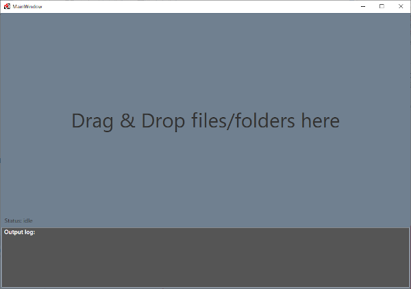
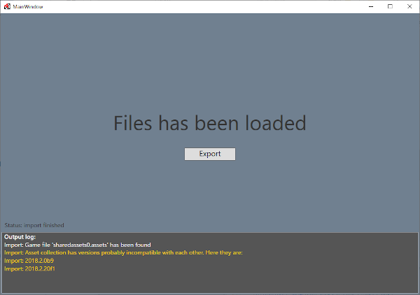
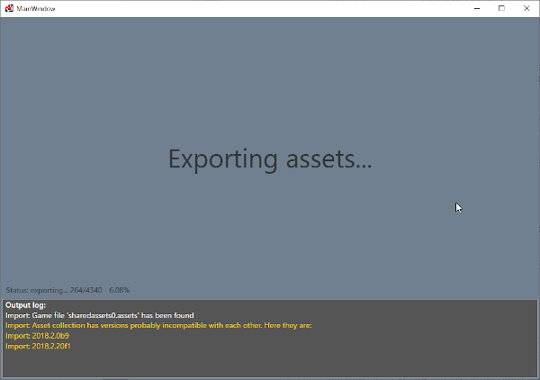
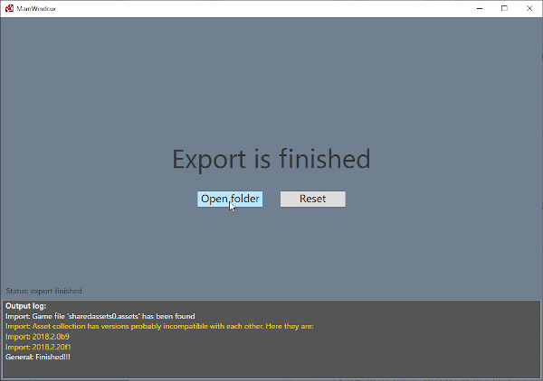

# ゲームソースの解析準備
　ゲームソースの解析のための下準備は、大きく二つに分かれる。ひとつはコードを改造するための下準備。もうひとつは画像やアニメーションなどリソースファイルを追加/差替えるための下準備になる。
　以下、各々の手順を記述する。
1. [各ファイルの配置位置](#files)
1. [コードを逆アセンブルする](#disassemble_code_for_win)
1. [ゲーム内使用アセット(リソースファイル)を展開する](#unpack_assets)

## 各ファイルの配置位置
### コードファイル
　ゲームのほぼ全容は先に抽出した5つのDLLから読み取れる。各DLLのうちKlei社が作成・改修（？）したものが2本、他ライブラリが3本ある。
DLLファイル | 詳細
------------ | --------------------------------------------------
Assembly-CSharp.dll | ONI本体
Assembly-CSharp-firstpass.dll | Unityフレームワークの基本ライブラリ及びKlei独自の基本ライブラリ？
0Harmony.dll | Harmonyフレームワークライブラリ
UnityEngine.CoreModule.dll | Unityエンジン本体(コア)
UnityEngine.dll | Unityエンジン本体

### リソース(アセット)ファイル
　ONIがインストールされているディレクトリ内に、 **\OxygenNotIncluded_Data** ディレクトリがある。このディレクトリ内にある次の3つのファイルが、Kleiにより作成されたゲーム内アセットバンドルファイルになる。
- sharedassets0.assets
- sharedassets1.assets
- sharedassets2.assets
　*備考 3つのアセットバンドルファイルはmetaファイル以外重複するデータが多く、なぜ3つのファイルあるのか今のところ良くわかっていない。少なくともsharedassets2.assetsファイルが一番多くのアセットを包有している。下記のゲーム内アセットを展開する記事ではsharedassets0.assetsから展開をしているが、sharedassets2.assetsさえ展開してしまえばMOD作製上は事足りるのかも知れない。*

## コードを逆アセンブルする(Windows版)
　コードの逆アセンブルは、先にインストールしたdnSpyを使用して行うのが一番手軽になる。以下、その手順を記述する。
### dnSpyを立ち上げる

### Assembly-CSharp.dllライブラリの読み込み
　dnSpyはひじょうに強力なツールな反面、間違って元のDLLを破壊しかねない機能も備えている。万一の事故を防止するためにも、以下は別のディレクトリに確保したDLLファイルに対して行うのが望ましい。
　メニューの **[File]** - **[Open]** をクリックし、 **Assembly-CSharp.dll** のあるディレクトリを指定する。

　**[開く]** をクリックし、DLLファイルを読み込む。

　読み込まれたファイルは、 **Assembly Explorer** の一覧に追加される。

　そのままdnSpy上で、各ファイルのコードを閲覧できる。

　同様にして、**Assembly-CSharp-firstpass.dll** の内容も閲覧できる。両DLL内のソースを確認すれば、ほぼONIの全体像は把握可能。

### Visual Studio プロジェクト（ソリューション）として書き出す
　ただしdnSpy上の操作はやはりVisual Studioのそれとは微妙に違っているので、細かい点で使いにくさを感じるかもしれない。その場合、以下の手順でプロジェクト（及びソリューション）としてDLLファイルの内容をエクスポートできる。
　プロジェクトとしてエクスポートするDLL(Assembly-CSharp.dll)を選択した状態で、**[File]** - **[Export Project]** をクリックする。

　**Export to Project** ダイアログが表示されたら、Folderに **プロジェクトを配置したいディレクトリ** を設定する。また、**Version** や **Language** その他オプションの指定は十分に注意する事。

　**[Export]** ボタンをクリックすると、逆アセンブル処理でDLL内のコードが一括処理され、**指定ディレクトリ内にDLLと同名のディレクトリが生成され**、プロジェクトの全ソースがその中に出力される。
　**ソリューションファイル** は指定ディレクトリ内にやはりDLLと同名で生成される。

　**Open project in Visual Studio** のチェックをしていると、出力後に自動的にVisual Studioが当該プロジェクトを開いた状態で起動する。裏にはdnSpyが残ったままなので、適時終了する事。

　必要なら同様にしてAssembly-CSharp-firstpass.dllもエクスポートする。

### OSX、Linuxの場合
　※ OSXやLinuxの場合、ILSpyを使用してコマンドライン上で逆アセンブルする方法が有望かと思う。

## ゲーム内使用アセット(リソースファイル)を展開する(Windows版)

### uTinyRipperを使用してアセットバンドルを展開する
　**uTinyRipper.exe** ファイルを実行する。

　uTinyRipperの画面が表示されたら、別途エクスプローラを立ち上げ、アセットバンドルのあるディレクトリを開く。

　エクスプローラから **sharedassets0.assets** ファイルをuTinyRipper上へ **ドラッグ** すると、解析処理が動く。無事に解析できると、下記の画面になる。

　上記画面が表示されたら、**[Export]** ボタンをクリックし、フォルダーの参照ダイアログでエクスポートするディレクトリを指定する。なお、「ONI-Exports」などゲーム内アセット専用のディレクトリを用意した方が良い。
　エクスポート中は下記のような画面になる。エクスポートは時間がかかるので注意。

　正常にエクスポート処理が行われれば、**Export is finished** の文字が表示される。

　**[Open folder]** ボタンをクリックすれば、エクスポートしたアセットのディレクトリがエクスプローラで開く。
　続けて **sharedassets1.assets**、**sharedassets2.assets** ファイルをエクスポートするなら、**[Reset]** ボタンをクリックしたあと同様の操作を行ってエクスポートする。

### OSX、Linuxの場合
　※ OSXやLinuxの場合、別の何らかのツールを用いてアセットバンドルを展開しておく必要がある。

### アセット内のディレクトリ
　展開したsharedassets0.assets(及びsharedassets1.assets、sharedassets2.assets)フォルダを開くと、アセットデータの種別ごとに整理された、各データを格納したディレクトリが並んでいる。MODで必要な画像及びアニメーションアセットの格納されているディレクトリは、次の2つのディレクトリになる。
- **TextAsset** - ビルドファイル・アニメーションファイルと呼称する2種類のバイナリファイルが混在して格納されている。
- **Texture2D** - 画像ファイル(アニメーションパーツ)がPNG形式で格納されている。
