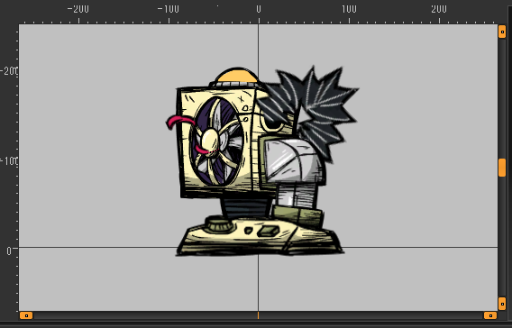
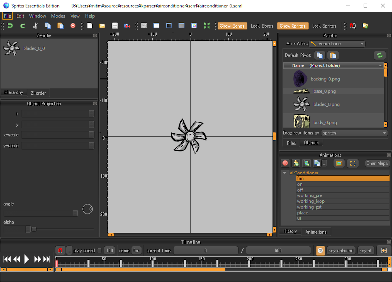
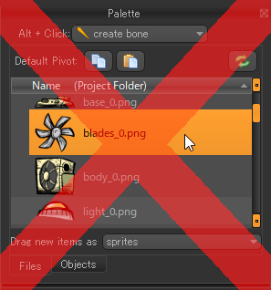
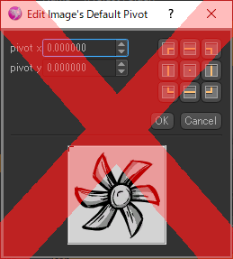

# グラフィック及びアニメーションの追加・変更

　以下の章では、すでにK-ParserおよびSpriterの導入、アセットバンドルの展開を行っている事を前提とする。
　まだ行ってない場合、以下のリンク先を参照して行う事。

- [MOD開発環境の構築画像/アニメーション開発環境](configure_mod_dev_env.md#graphics-environment)
- [ゲームソースの解析準備/ゲーム内使用アセット(リソースファイル)を展開する](analysing_game_sources.md#unpack_assets)


1. [展開した既存の(Klei方式)アセットファイルからSpriter形式への変換](#convert_kanim_to_scml)
1. [Spriter形式のアニメーションファイルからKlei方式アセットへの変換](#convert_scml_to_kanim)
1. [SpriterでKleiアニメーションを作るさいの注意事項](#caution_about_kanim)




<a name="convert_kanim_to_scml"></a>
## 展開した既存の(Klei方式)アセットファイルからSpriter形式への変換

　じっさいにゲーム内で使われている「空調設備」のアニメーションを取り出してみる。

### 対象ファイルの抜き出し

　展開済みの **sharedassets0.assets** 内にある次のディレクトリから、指定する各ファイルを取り出し、 一つのディレクトリ下に配置する。

- Texture2D
  - **airconditioner_0.png** - 「空調設備」のアニメーション画像ファイル
- TextAsset
  - **airconditioner_build.bytes** - 「空調設備」のビルドバイナリファイル
  - **airconditioner_anim.bytes** - 「空調設備」のアニメーションバイナリファイル


### コマンドライン・プロンプトを開く

　コマンドライン・プロンプト(Windows10 **Windows PowerShell**)(Windows **コマンド プロンプト(cmd)**)(OSX **ターミナル**)を開く。

　下記のコマンドを入力し、Javaが利用可能な事を確認する。(`>`は入力不要、OSXやLinuxでは`$`と表示されているはず)

```
> java -version
openjdk version "13" 2019-09-17
OpenJDK Runtime Environment AdoptOpenJDK (build 13+33)
Eclipse OpenJ9 VM AdoptOpenJDK (build openj9-0.16.0, JRE 13 Windows 10 amd64-64-Bit Compressed References 20190916_74 (JIT enabled, AOT enabled)
OpenJ9   - 867dab457
OMR      - d4c85c31
JCL      - 2858e3f001 based on jdk-13+33)
```

　上記のように組み込んだJDKのバージョン情報及びJVM等の情報が表示されればOK。


### K-Parserでファイルを変換する

　プロンプト上でK-Parserの実行jarファイル **kparser.jar** のあるディレクトリに移動する。

　下記ようにコマンドを入力する。(`[]`は入力しない、各フルパスは各々の環境に合わせて入力する事)

```
> java -jar kparser.jar scml [airconditioner_0.pngファイルのフルパス] [airconditioner_build.bytesファイルのフルパス] [airconditioner_anim.bytesファイルのフルパス]
```

　ひとしきり変換ログが流れ、プロンプトに戻るはず。指定を間違えているとエラーが表示される。とくに **scml** のコマンドの有無や、指定ファイルの順序には気をつけて指定する事。

### scmlファイルをSpriterで開く

　変換が終わると、airconditioner_0.pngらを保存したディレクトリに **scml** というディレクトリが追加されている。中には変換された次の20個のファイルが存在するはず。

- airconditioner_0.scml
- 19個の.pngファイル(パーツ毎の画像ファイル)

　**airconditioner_0.scml** を（通常はダブルクリックで）Spriterで開く。



　ここまで来れば、Spriter上でアニメーションの確認や、再編集等ができるようになる。


<a name="convert_scml_to_kanim"></a>
## Spriter形式のアニメーションファイルからKlei方式アセットへの変換

　ここでは実際に、scmlに変換した「空調設備」をKleiアニメーション方式のアセットデータへ変換し直す。

　K-Parserのあるディレクトリにいる状態で、次のようにコマンドを入力する。

```
> java -jar kparser.jar kanim [airconditioner_0.scmlファイルのフルパス]
```

　airconditioner_0.scmlファイルのある **同一ディレクトリ** 上(つまりこの場合scmlディレクトリ内)に、次の4つのファイルが生成されるている事を確認する。

- airConditioner.png
- airconditioner_build.bytes
- airconditioner_anim.bytes
- airConditioner.atlas

### MODで使用するアニメーションを作成した場合

　変換で生成された4つのファイルのうち、.atlasを除いた **3つのファイル** をMODディレクトリ内の`\anim\assets\[アセット名]`ディレクトリ下に配置する。


<a name="caution_about_kanim"></a>
## SpriterでKleiアニメーションを作るさいの注意事項 **重要**

　Kleiアニメーション形式には色々と制限があり、Spriterプロジェクトを完全にKleiアニメーションへ変換する事はできない。以下、Kleiアニメーションに変換するために **必要な要件** を述べる

- 全てのスプライトパーツファイル(pngファイル)のファイル名は、 **接尾にアンダースコアとナンバリング(`_0`)** が付与されている事(例：object_0.png)。ナンバリングは必ず0から開始する。
  - 同名の（複数のバージョンがある）スプライトパーツは、`_0`、`_1`のように昇順に番号を振る事。
  - 別名のスプライトパーツは必ず`_0`からナンバリングされる事(例：object_0.png、ui_0.png)。
- Kleiアニメーション形式はSpriterほど細かいタイミングでのアニメーションができない。そのため、アニメーションを編集するさいは必ず **Timeline Snapping Optionsを有効にして33msに設定** する事。
- 個々のスプライトに **スプライトパレットから独自のpivotポイントを設定しない** こと。Kleiアニメーションは個別のpivot情報を全シーンを通して一貫して処理することができない。
  - 回転軸の変更は、各アニメーションを編集する段階で **必ず手作業(マウスドラッグ)** で毎回行う事。

　以下は行なってはいけないpovot設定操作の画像になる。



