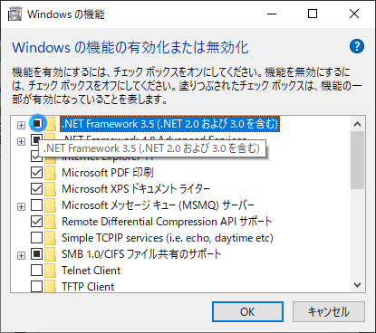
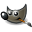

# MOD開発環境の構築

1. [ゲームの場所](#install-directory)
1. [MODを配置する場所](#mod-directory)
1. [プログラム開発環境](#programming-environment)
1. [画像/アニメーション開発環境](#graphics-environment)
1. [必須ではないがあれば役に立つであろうソフト](#other-software)

## ゲームの場所

### Windowsの場合

　Windows Store以外でインストールしたアプリケーションは、おおよそ次の二箇所のディレクトリに保存される。

　ドライブ名は任意に指定・変更してないかぎりはCドライブになる。

- [ドライブ名:]\Program Files (x86)
- [ドライブ名:]\Program Files

#### Steamで購入した場合

　ONIは下記ディレクトリにインストールされている。

- [ドライブ名:]\Program Files (x86)\Steam\steamapps\common\OxygenNotIncluded

## MODを配置する場所

- **Windows**
  - [ドキュメント]\Klei\OxygenNotIncluded\mods
- **OSX**
  - [ホームフォルダ]/Library/Application Support/Klei/OxygenNotIncluded/mod
    - だいたいの場合はここにあると思われる
  - [ホームフォルダ]/.config/Application Support/Klei/OxygenNotIncluded/mod

　MODはDLLファイル単体を指すのではなく、そのDLLファイルを内包するディレクトリ(これがMOD名になる)および構成するサブディレクトリやファイル全体を纏めてひとつのMODとされる。

　当該ディレクトリの **サブディレクトリ** 内に配置されたMODはONI起動時に自動的に読み込まれ、ゲーム内メニューの[MOD]でサブスクライブできるようになる。

　devなど適当な名前のディレクトリを当該ディレクトリ下につくり、その中に開発した（開発中の）MODをまとめて配置すると良い。

#### Steamで購入した場合の注意点

　mods内にある **Steam** ディレクトリの中にはSteamワークショップで導入したMODが数字名のディレクトリの下に配置されている。

　これらのMODは、ワークショップに登録されたMOD名がMOD一覧に表示される。

　同ディレクトリ内には開発したMODは配置しない事。

## プログラム開発環境

### Windowsの場合

#### .NET3.5 フレームワークのインストール

　ONIは.NET3.5上で動作している。より新しいバージョンの.NETが導入されている場合、開発のために.NET3.5を導入し直す(有効にする)必要が出てくる。

[Microsoft .NET Framework 3.5](https://dotnet.microsoft.com/download/thank-you/net35-sp1)

　上記ページ[ダウンロード]よりダウンロードし、インストールする。インストールには数分かかる。

　Windows10を使用している場合、コントロール・パネルからインストールできる。コントロール・パネルを開き、 **[プログラムと機能]** をクリック、 **Windowsの機能の有効化または無効化** をクリックして出てくるダイアログボックスで **.NET Framework 3.5 (.NET 2.0および3.0を含む)** をチェック(黒い■の状態に)する。

#### Visual Studio 2019 のインストール

　本体の開発はVisual Studio 2017で開発されている（らしい）ので、同開発ツールが導入されているなら改めてダウンロードする必要は無い。
[ダウンロード Visual Studio 2019](https://visualstudio.microsoft.com/ja/downloads/)

　Community版を[無料ダウンロード]でダウンロードし、インストールする。インストールには数分かかる。

#### dnSpy のインストール

　dnSpyは、0x04d氏の作製したC#製DLL用逆アセンブルツール。

　ONIのオリジナルソースを適時解析するために必要になる。MODは基本的にオリジナルソースに被せるかたちで実装していくため、必要になる。

[0xd4d/dnSpy(releases)](https://github.com/0xd4d/dnSpy/releases)

　zipファイルをダウンロード後、任意のディレクトリに展開、ファイルの中にあるdnSpy.exeを実行(ダブルクリック)する。

### 開発に必要なDLLの確保

　ONIの全バイナリの中で、MODに必要なDLLは数本に限られる。利便性のために先述したONIのインストールディレクトリ内の **\OxygenNotIncluded_Data\Managed** から、次のDLLを抜き出して適当なディレクトリに置いておく。

1. 0Harmony.dll
1. Assembly-CSharp.dll
1. Assembly-CSharp-firstpass.dll
1. UnityEngine.CoreModule.dll
1. UnityEngine.dll

## 画像/アニメーション開発環境

### uTinyRipper のインストール

　mafaca氏の作製したアセットバンドルファイルから各アセットファイルを取り出したり、アセットバンドルファイルを作成することができるツール。ONIのアセットバンドルファイルから各アセットファイルを展開するために使用する。

　Windows用のツールなので、Mac等は別途MONO環境でコンパイルするか別の手段が必要になる。

[mafaca/UtinyRipper](https://github.com/mafaca/UtinyRipper)

　ダウンロード後、zipファイルを任意のディレクトリに解凍する。

### K-Parser のインストール

　K-Parserはdaviscook477氏の作製したKleiアニメーション形式のファイルとSpriter(後述)プロジェクト形式との相互変換を行うツール。

#### Java13 JDKのインストール

　K-ParserはJava 9以上のバージョンのJDKを必要とする。現行バージョン(JDK 13)をダウンロードし、インストールする。

　※ なお、Java 8を最後にOracleからJREのみの配布は行われていない。

　JDK 13はオープンソースとして、Oracleほか各社から配布されている。好みに応じてダウンロード、インストールする。

- [Oracle JDK](https://www.oracle.com/technetwork/java/javase/downloads/jdk13-downloads-5672538.html)
- [jdk.java.net(Oracle OpenJDK)](http://jdk.java.net/13/)
- [AdoptOpenJDK](https://adoptopenjdk.net/index.html?variant=openjdk13&jvmVariant=hotspot)
- [Red Hat OpenJDK](https://developers.redhat.com/products/openjdk/download)
- [Zulu Community](https://www.azul.com/downloads/zulu-community/?&architecture=x86-64-bit&package=jdk)
- [Liberica JDK](https://bell-sw.com/pages/java-13.0.1/)
- [SapMachine](https://sap.github.io/SapMachine/)
- [ojdkbuild](https://github.com/ojdkbuild/ojdkbuild)
- 以下はJDK 11
  - [Amazon Corretto](https://aws.amazon.com/jp/corretto/)

#### K-Parserのダウンロード

[daviscook477/kparser(releases)](https://github.com/daviscook477/kparser/releases)

　kparser.jarをダウンロードし、任意のディレクトリに配置しておく。

#### K-Parserのドキュメント

[daviscook477/kparser](https://github.com/daviscook477/kparser)

　なお現在のところ、Unityによるアセットのバンドル化や配置ディレクトリなどの記述が古く、このドキュメント通りに行っても動作しないので注意すること。

### Spriter のインストール

　Spriterは、BrashMonkey LLC 社製の2Dアニメーションエディタ。Flashでお馴染みのスプライトアニメーションが作れる。

　ONIのMODで画像やアニメーションを作成するさいに必要なアセット変換ツール、KParserが唯一対応している。

　有償であるSpriter Proのほか、無償のSpriterを配布している。他にゲームを作製しているなどヘビーユーザーでなければこの無償版で十分な機能を備えている。

　Windows版のほか、OSX版、Linux版を配布している。

[Download Spriter (BrashMonkey)](https://brashmonkey.com/download-spriter-pro/)

　OSに応じてダウンロードし、インストールする。

### 画像作成ソフトの用意

　画像作成ソフトは何でも構わないが、PNG形式でアルファ値が出力できる(透過PNG)ものを用意する事。商用(有料)ソフトで有名なところでは、PhotoshopやCLIP Studioなどがある。

　フリーソフトでは以下のようなソフトがある。

- ][FireAlpaca PGN Inc.](https://firealpaca.com/ja/)
- [Krita Desktop](https://krita.org/jp/)
- [GIMP2](https://www.gimp.org/)

## 必須ではないがあれば役に立つであろうソフト

- [Unity 2018.3.0](https://unity3d.com/jp/get-unity/download/archive)
  - ONIのベースプラットホーム。開発バージョンを間違えないように(Unity 2018.3.0f2)。
  - 先に[Unity Hub](https://unity3d.com/jp/get-unity/download)をダウンロードしておくと便が良い。
- [AssetStudio](https://ci.appveyor.com/project/Perfare/assetstudio/branch/master/artifacts)
  - AssetBundle内を展開せずにエクスプローラライクに閲覧できるソフト。Windows専用。
