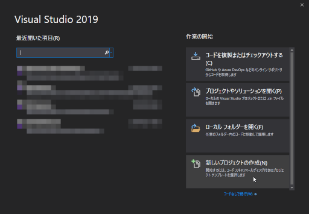
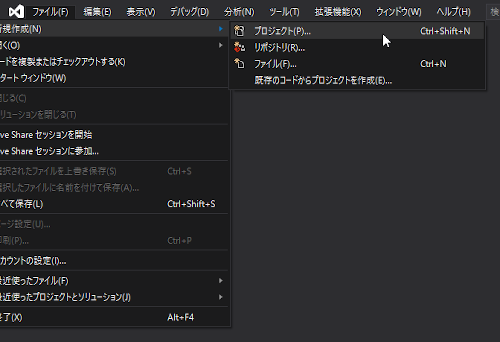
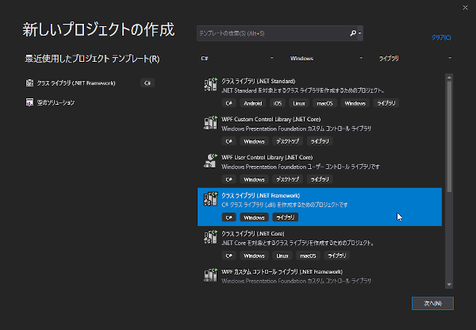
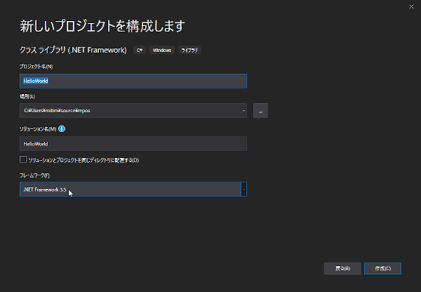
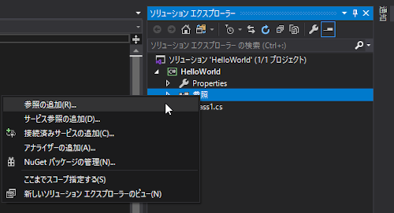
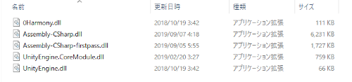
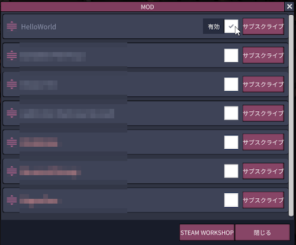

# ファーストステップ：Hello Worldをつくる

　この章では、じっさいにMODを作成してHello World!の文字列（いつものアレ）をログファイルに出力するまでを目指す。基本的にオリジナルのドキュメント通りの流れになるが、画面等はVisual Studio 2019を使用したバージョンに置き換えている。

　英語に自信があるなら、オリジナルのドキュメントも読んだ方が良い。とくにディスカッション部分は参考になる。

## オリジナルのドキュメント

[Tutorial How to create a basic mod for ONI](https://forums.kleientertainment.com/forums/topic/107833-tutorial-how-to-create-a-basic-mod-for-oni/)

著者：chromiumboy

## Sorry

　以下のチュートリアルは、Windows10下でVisual Studio2019を使用する。OSX及びLinuxユーザーの人は申し訳ないが、各自努力をしてこのドキュメントを拡充して欲しい。

## ステップ1

　Visual Studioを起動し、新しいプロジェクトを作る。





## ステップ2

　**クラスライブラリ(.NET Framework)** を選択し、対象フレームワークを **.NET framework 3.5** に設定する。

　.NET frameworkは必ず3.5を選択すること！ONIはこのバージョンのフレームワークで作製されている。





### .NET framework 3.5が選択できない場合

　.NET framework3.5が正しくインストールされていないので、[MOD開発環境の構築/プログラム開発環境](configure_mod_dev_env.md#programming-environment)に戻って再度インストールすること。

## ステップ3

　**ソリューションエクスプローラ** を見る（通常画面右側のペインに表示されている）。エクスプローラにある **[参照]** から **[参照の追加]** を選択する。




　表示された **参照マネージャ** で **[参照]** ボタンをクリックし、先に抜き出したDLL5本を選択する。




　参照マネージャに戻ったら追加したDLL5本がチェックされている事を確認する。


## ステップ4

　これでコードを書く下地が完成。

　ここでは、ログファイルに「Hello World！」と出力するコードを記述したい。ONIは(多くのUnity製ゲームと同様に)Harmonyフレームワークを搭載しており、同フレームワークによりパッチを既存ソース内に埋め込む。詳しくは別ページの[Harmonyフレームワークの使い方]を参照。

　表示されている空のクラス(Class1)に、次のようにコードを記述する。

```C#
using Harmony;

namespace HelloWorld
{
    [HarmonyPatch(typeof(GeneratedBuildings), "LoadGeneratedBuildings")]
	internal class HelloWorld_GeneratedBuildings_LoadGeneratedBuildings
    {
		private static void Postfix()
		{
			Debug.Log("Hello World");
		}
    }
}
```

## ステップ5

　書いたコードを保存したら、メニューの **[ビルド]** - **[ソリューションのビルド]** でコードをコンパイルする。エラーが出なければ成功。


## ステップ6

　出力結果に示されたディレクトリに、HelloWorld.dllがビルドされている。このDLLファイルをコピーし、**[MODを配置する場所](configure_mod_dev_env.md#mod-directory)** 下に作った適当なディレクトリ内に貼り付ける。

## ステップ7

　いつものようにONI(ゲーム)を立ち上げる。スタート画面の **[MOD]** をクリックし、MOD一覧に表示されているHelloWorldにチェックを付け閉じる。




　エラーもなくゲームが再起動されたら、そのまま **ゲームを終了** する。

## ステップ8

　ゲームのログは、通常下記ディレクトリ内に **output_log.txt** というファイル名で出力されている。
- Windows10の場合： **[ユーザディレクトリ]\AppData\LocalLow\Klei\Oxygen Not Included**

　ログを適当なエディタ(テキストビューアでもOK)で開き、次のラインが出力されていれば成功となる。

```
[06:50:22.149] [1] [INFO] Loading mod content DLL [HelloWorld:HelloWorld] (provides DLL)
[06:50:22.150] [1] [INFO] Loading MOD dll: HelloWorld.dll

[06:50:23.381] [1] [INFO] Subscribe to mod HelloWorld

[06:50:27.498] [1] [INFO] Hello World
```

*おめでとう！きみはMOD作製の第一歩を無事踏み出せた！*
