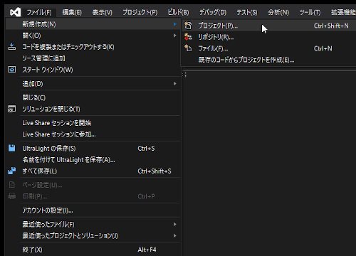
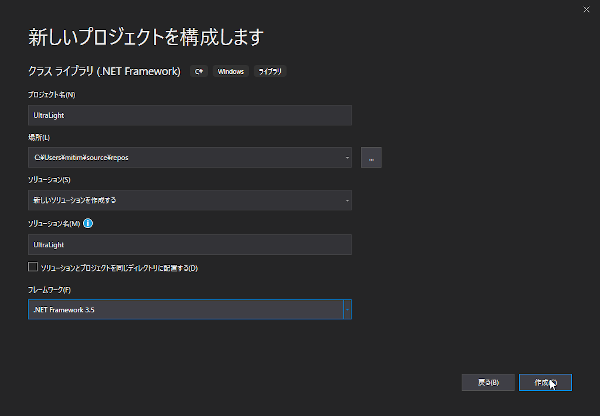
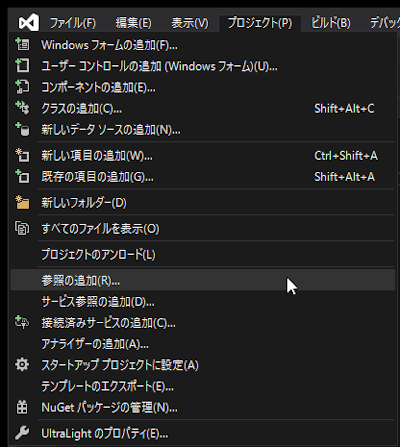
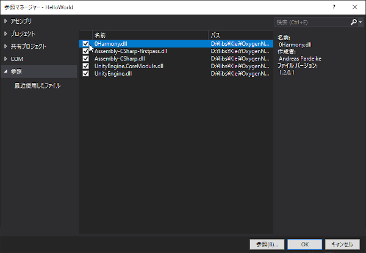
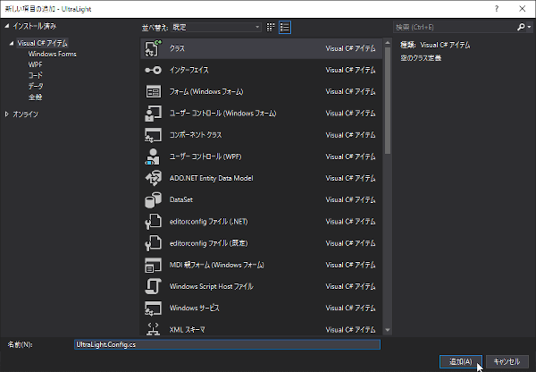
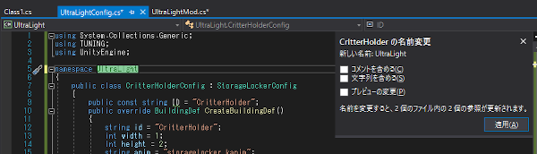

# UltraLightを作ってみる

　この章では、Darth Nihilus氏の公開している動画手順に従って、UltraLightMOD(光の届く範囲が広すぎるチート級のライト "Ultra Light" を追加するMOD)が完成するまでの手順を示す。

1. [オリジナルの動画](#movie)
1. [プロジェクトの新規作成](#new_project)
1. [2つのクライスファイルコード](#two_classes)
1. [ゲーム内で使用する説明文を整える](#edit_in_game_desc)
1. [CeilingLightConfigクラスのコードを転記する](#code_copy)
1. [ゲーム内の設定値を変更する](#edit_configure)
1. [定数クラスを追加で定義](#add_const)
1. [光の形(光り方)を変更する](#change_shape)
1. [ライトを建造可能にする](#add_to_plan)
1. [あと一息！](#last_work)
1. [お疲れさま!!](#the_end)

　なお、じっさいにコードを書くさいは *楽をする* こともできる。だが、 **何をやっているのかよくわからない** 箇所は自分の手を動かして記述する事をお勧めする。手を動かした方が理解も早くなる。

<a name="movie"></a>
## オリジナルの動画

[Making a simple Oxygen Not Included mod. New light source.](https://youtu.be/kZwEF2DrZ0k) (17:51)

　各節の冒頭に動画へのリンクがある場合、それはこのオリジナルの動画を特定時間へジャンプして再生する指定になっている。動画を通して見たり、一時停止しながら同時に作業するなら、各々の動画リンクをクリックする必要はない。

<a name="new_project"></a>
## プロジェクトの新規作成

　動画ではニーズの確認から始まり、既存のMODプロジェクトを **いきなりコピー** するところから始まる。
　ここでは新規プロジェクトを起こしていく。

　まずVisual Studio 2019を立ち上げ、メニューの **[ファイル]** - **[新規作成]** - **[プロジェクト]** を選択する。



　Hello World の章と同じ手順で、空の **クラスライブラリ(.NET Framework 3.5)** プロジェクトを生成する。
　プロジェクト名は **UltraLight** とする。




　[MOD開発環境の構築/プログラム開発環境](configure_mod_dev_env.md#programming-environment)で言及している **開発に必要なDLL** を、メニューの **[プロジェクト]** - **[参照の追加]** で(またはソリューションエクスクローラでプロジェクトを右クリックして追加)追加する。




<a name="two_classes"></a>
## 2つのクライスファイルコード

[動画：クラスファイル](https://youtu.be/kZwEF2DrZ0k?t=120) (2:00 ～)

　動画で既存MODのプロジェクトを開く関係で、最初から2本のクラスファイルが存在している。各コードを下記に示すので、同様に記述しておく。

UltraLightConfig.cs

```C#
using System.Collections.Generic;
using TUNING;
using UnityEngine;

namespace CritterHolder
{
    public class CritterHolderConfig : StorageLockerConfig
    {
        public const string ID = "CritterHolder";
        public override BuildingDef CreateBuildingDef()
        {
            string id = "CritterHolder";
            int width = 1;
            int height = 2;
            string anim = "storagelocker_kanim";
            int hitpoints = 30;
            float construction_time = 10f;
            float[] tier = BUILDINGS.CONSTRUCTION_MASS_KG.TIER4;
            string[] raw_MINERALS = MATERIALS.RAW_MINERALS;
            float melting_point = 1600f;
            BuildLocationRule build_location_rule = BuildLocationRule.Anywhere;
            EffectorValues none = NOISE_POLLUTION.NONE;
            BuildingDef buildingDef = BuildingTemplates.CreateBuildingDef(id, width, height, anim, hitpoints, construction_time, tier, raw_MINERALS, melting_point, build_location_rule, BUILDINGS.DECOR.PENALTY.TIER1, none, 0.2f);
            buildingDef.Floodable = false;
            buildingDef.AudioCategory = "Metal";
            buildingDef.Overheatable = false;
            return buildingDef;
        }

        public override void ConfigureBuildingTemplate(GameObject go, Tag prefab_tag)
        {
            List<Tag> mod = new List<Tag>();
            mod.AddRange((IEnumerable<Tag>)STORAGEFILTERS.BAGABLE_CREATURES);
            mod.AddRange((IEnumerable<Tag>)STORAGEFILTERS.SWIMMING_CREATURES);

            SoundEventVolumeCache.instance.AddVolume("storagelocker_kanim", "StorageLocker_Hit_metallic_low", NOISE_POLLUTION.NOISY.TIER1);
            Prioritizable.AddRef(go);
            Storage storage = go.AddOrGet<Storage>();
            storage.capacityKg = 1000000f;
            storage.showInUI = true;
            storage.allowItemRemoval = true;
            storage.showDescriptor = true;
            storage.storageFilters = mod;
            storage.storageFullMargin = STORAGE.STORAGE_LOCKER_FILLED_MARGIN;
            storage.fetchCategory = Storage.FetchCategory.GeneralStorage;
            CopyBuildingSettings copyBuildingSettings = go.AddOrGet<CopyBuildingSettings>();
            copyBuildingSettings.copyGroupTag = GameTags.StorageLocker;
            go.AddOrGet<StorageLocker>();
        }

        public override void DoPostConfigureComplete(GameObject go)
        {
            go.AddOrGetDef<StorageController.Def>();
        }

    }
}
```

UltraLightMod.cs

```C#
using System;
using System.Collections.Generic;
using Database;
using Harmony;

namespace CritterHolder
{
    public class CritterHolderConfigMod
    {

        [HarmonyPatch(typeof(GeneratedBuildings), "LoadGeneratedBuildings")]
        public class CritterHolderPatch
        {
            public static LocString NAME = new LocString("CritterHolder",
                                                        "STRINGS.BUILDINGS.PREFABS." + CritterHolderConfig.ID.ToUpper() + ".NAME");
            public static LocString DESC = new LocString("This building is a CritterHolder.",
                                                        "STRINGS.BUILDINGS.PREFABS." + CritterHolderConfig.ID.ToUpper() + ".DESC");
            public static LocString EFFECT = new LocString("CritterHolder is provided to you by " + STRINGS.UI.FormatAsLink("Korriban Dynamics", "KORRIBANDYNAMICS") + ".",
                                                        "STRINGS.BUILDINGS.PREFABS." + CritterHolderConfig.ID.ToUpper() + ".EFFECT");

            private static void Prefix()
            {
                Strings.Add(NAME.key.String, NAME.text);
                Strings.Add(DESC.key.String, DESC.text);
                Strings.Add(EFFECT.key.String, EFFECT.text);
                ModUtil.AddBuildingToPlanScreen("Food", CritterHolderConfig.ID);
            }

            private static void Postfix()
            {
                object obj = Activator.CreateInstance(typeof(CritterHolderConfig));
                BuildingConfigManager.Instance.RegisterBuilding(obj as IBuildingConfig);
            }
        }

        [HarmonyPatch(typeof(Db), "Initialize")]
        public class CritterHolderDbPatch
        {
            private static void Prefix()
            {
                List<string> ls = new List<string>(Techs.TECH_GROUPING["MedicineI"]) { CritterHolderConfig.ID };
                Techs.TECH_GROUPING["MedicineI"] = ls.ToArray();
            }
        }

    }
}
```

　2本のクラスファイルをメニューの **[プロジェクト]** - **[クラスの追加]** で(またはソリューションエクスクローラでプロジェクトを右クリックして追加)追加する。




　※ [文字列を含める]をチェックするのを忘れないように！

　クラスファイルの（間違っている）namespaceを **"UltraLight"** に置換する。ダブルクリックで `CritterHolder` を選択状態にし、F2もしくは 右クリック - [名前の変更] で一括変更できる。



<a name="edit_in_game_desc"></a>
## ゲーム内で使用する説明文を整える

[動画：説明文用の文字列の修正](https://youtu.be/kZwEF2DrZ0k?t=172) (2:52 あたり)

　UltraLightConfigModクラス内の次のstatic変数を(動画の通りに)修正する。

- `public static LocString NAME`
- `public static LocString DESC`
- `public static LocString EFFECT`

<a name="code_copy"></a>
## CeilingLightConfigクラスのコードを転記する

[動画：CeilingLightConfigからコードをコピー](https://youtu.be/kZwEF2DrZ0k?t=225) (3:45 ～)

　前もってUltraLightConfigクラスを空にしておく。
　dnSpyを使って(もしくは展開済みのゲームのソースから)、CeilingLightConfigクラスのコードを(クラス名以外丸ごと)転記する。
　※ IBuildingConfigからの継承部分は忘れがちなので注意！

<a name="edit_configure"></a>
## ゲーム内の設定値を変更する

[動画：UltraLightConfigの設定値調整](https://youtu.be/kZwEF2DrZ0k?t=271)（4:31 ～）

　ゲーム内設定値に関わるコードを修正する。
　UltraLightConfigクラス内のコードを(動画の通りに)修正する。

　また、コード内にあるID文字列をUltraLightに修正する。

### 変更点

- 消費電力を25wに
- 発熱量を0.3Kwに
- 装飾値をTier1相当に

<a name="add_const"></a>
## 定数クラスを追加で定義

[動画：新たな定数値の追加](https://youtu.be/kZwEF2DrZ0k?t=442)（7:22 ～）

照明の明るさ(lux)と範囲(radius/range)の設定値については、将来的な変更を容易にするために、また定数値が分散してるため、まとめて定数クラスとして定義してしまう。

<a name="change_shape"></a>
## 光の形(光り方)を変更する

[動画：光の形を変更](https://youtu.be/kZwEF2DrZ0k?t=540)（9:00 ～）

　照明の光の形を、従来の逆扇形から円形に変更する。

<a name="add_to_plan"></a>
## ライトを建造可能にする

[動画：ライトを建造プランに乗せる](https://youtu.be/kZwEF2DrZ0k?t=589)（9:49 ～）

　ライト(建築物)を建造できるように、ゲーム内カテゴリー **[ロケット]** の建造一覧に追加する。
　また同様に、研究カテゴリにも追加する。

### 最終的な各コード

UltraLightConfig.cs

```C#
using TUNING;
using UnityEngine;

namespace UltraLight
{
    public class MyConst
    {
        public static int l = 3600;
        public static float r = 20f;
    }
    public class UltraLightConfig : IBuildingConfig
    {
        public const string ID = "UltraLight";

        public override BuildingDef CreateBuildingDef()
        {
            string id = "UltraLight";
            int width = 1;
            int height = 1;
            string anim = "ceilinglight_kanim";
            int hitpoints = 10;
            float construction_time = 10f;
            float[] tier = BUILDINGS.CONSTRUCTION_MASS_KG.TIER1;
            string[] all_METALS = MATERIALS.ALL_METALS;
            float melting_point = 800f;
            BuildLocationRule build_location_rule = BuildLocationRule.OnCeiling;
            EffectorValues none = NOISE_POLLUTION.NONE;
            BuildingDef buildingDef = BuildingTemplates.CreateBuildingDef(id, width, height, anim, hitpoints, construction_time, tier, all_METALS,
                melting_point, build_location_rule, BUILDINGS.DECOR.BONUS.TIER1, none, 0.2f);
            buildingDef.RequiresPowerInput = true;
            buildingDef.EnergyConsumptionWhenActive = 25f;
            buildingDef.SelfHeatKilowattsWhenActive = 0.3f;
            buildingDef.ViewMode = OverlayModes.Light.ID;
            buildingDef.AudioCategory = "Metal";
            return buildingDef;
        }

        public override void DoPostConfigurePreview(BuildingDef def, GameObject go)
        {
            LightShapePreview lightShapePreview = go.AddComponent<LightShapePreview>();
            lightShapePreview.lux = MyConst.l;
            lightShapePreview.radius = MyConst.r;
            lightShapePreview.shape = LightShape.Circle;
        }

        public override void ConfigureBuildingTemplate(GameObject go, Tag prefab_tag)
        {
            go.GetComponent<KPrefabID>().AddTag(RoomConstraints.ConstraintTags.LightSource, false);
        }

        public override void DoPostConfigureComplete(GameObject go)
        {
            go.AddOrGet<LoopingSounds>();
            Light2D light2D = go.AddOrGet<Light2D>();
            light2D.overlayColour = LIGHT2D.CEILINGLIGHT_OVERLAYCOLOR;
            light2D.Color = LIGHT2D.CEILINGLIGHT_COLOR;
            light2D.Range = MyConst.r;
            light2D.Angle = 2.6f;
            light2D.Direction = LIGHT2D.CEILINGLIGHT_DIRECTION;
            light2D.Offset = LIGHT2D.CEILINGLIGHT_OFFSET;
            light2D.shape = LightShape.Circle;
            light2D.drawOverlay = true;
            light2D.Lux = MyConst.l;
            go.AddOrGetDef<LightController.Def>();
        }
    }
}
```

UltraLightMod.cs

```C#
using System;
using System.Collections.Generic;
using Database;
using Harmony;

namespace UltraLight
{
    public class UltraLightConfigMod
    {

        [HarmonyPatch(typeof(GeneratedBuildings), "LoadGeneratedBuildings")]
        public class UltraLightPatch
        {
            public static LocString NAME = new LocString("Ultra Light",
                                                        "STRINGS.BUILDINGS.PREFABS." + UltraLightConfig.ID.ToUpper() + ".NAME");
            public static LocString DESC = new LocString("This building is a Ultra Light. Zis is a great source of light!!1111",
                                                        "STRINGS.BUILDINGS.PREFABS." + UltraLightConfig.ID.ToUpper() + ".DESC");
            public static LocString EFFECT = new LocString("Ultra Light is provided to you by " + STRINGS.UI.FormatAsLink("Korriban Dynamics", "KORRIBANDYNAMICS") + ".",
                                                        "STRINGS.BUILDINGS.PREFABS." + UltraLightConfig.ID.ToUpper() + ".EFFECT");

            private static void Prefix()
            {
                Strings.Add(NAME.key.String, NAME.text);
                Strings.Add(DESC.key.String, DESC.text);
                Strings.Add(EFFECT.key.String, EFFECT.text);
                ModUtil.AddBuildingToPlanScreen("Rocketry", UltraLightConfig.ID);
            }

            private static void Postfix()
            {
                object obj = Activator.CreateInstance(typeof(UltraLightConfig));
                BuildingConfigManager.Instance.RegisterBuilding(obj as IBuildingConfig);
            }
        }

        [HarmonyPatch(typeof(Db), "Initialize")]
        public class UltraLightDbPatch
        {
            private static void Prefix()
            {
                List<string> ls = new List<string>(Techs.TECH_GROUPING["BasicRocketry"]) { UltraLightConfig.ID };
                Techs.TECH_GROUPING["BasicRocketry"] = ls.ToArray();
            }
        }
    }
}
```

<a name="last_work"></a>
## あと一息！

[動画：保存からMODが動くまで](https://youtu.be/kZwEF2DrZ0k?t=681)（11:21 ～）

1. 保存（忘れずに！）する
1. ビルドする
  - HelloWorldと同じように、出力結果に示されたディレクトリにUltraLight.dllが生成されている。
1. フォルダを作って配置する
  - [MODを配置する場所](configure_mod_dev_env.md#mod-directory)にdllと同名のディレクトリを作成し配置する。
1. ゲームを起動してMODを読み込みテスト
  1. ゲームを起動する。
  1. MOD一覧でUltraLightを有効にして再起動する。
  1. ゲームが無事再起動したら、 **サンドボックスモード** でじっさいにゲームを動かしてみて、追加したUltraLightがちゃんと動作する事を確認する。

<a name="the_end"></a>
## お疲れさま!!

*おめでとう！きみはいよいよ本格的なMOD作製に歩み出した！*
