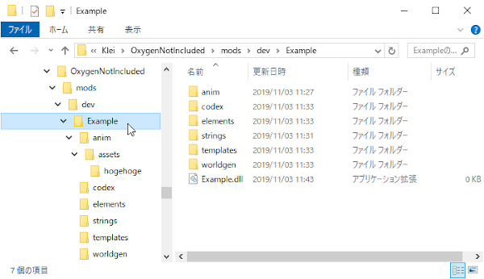

# MODディレクトリの構成

　mods\Steam内に配置される、また開発時にmods内(のサブディレクトリ)に配置するMODは、規定の階層構造で構築されていることをONIは望んでいる。

　また規定の階層構造であれば、グラフィック情報などは自動的に読み込まれゲームデータに組み込まれる仕組みをONI側で提供している。

## 当該MOD用のディレクトリ

　名前は何でも良いが、管理するうえでMODと同じ名前が良いだろう。

## ∟anim

　画像及びアニメーション用ディレクトリ。

　*※ 正式版以前ではanimsディレクトリで中にバンドル化されたアセットを配置していたが、正式版で変更された。注意すること！*

## |∟assets

　固定

## ||∟[アセット名]

　この階層には次の3つのファイル(Kleiアニメーション形式)を配置する。

- アニメーション画像(.pngファイル)
- アニメーションバイナリデータ(`_anim.byte`で終わるファイル)
- ビルドバイナリデータ(`_build.bytes`で終わるファイル)

　アセット名はゲーム内では小文字で扱われるので注意する事。念のため、小文字で命名しておいた方が無難。

　ONI側はこの階層に置かれたファイルを自動的にゲーム内に組み込む。そのさいのアニメーションID(正確にはそのハッシュ値)は **[アセット名]_kanim** になる。(`_kanim`は固定の接尾句)

## ∟strings

　この階層には、多言語設定ファイル(.poファイル)を配置する。

　この階層に置かれた.poファイルは自動的にゲーム内に組み込まれる。

## ∟*その他の予約されたディレクトリ*

　解析中。
